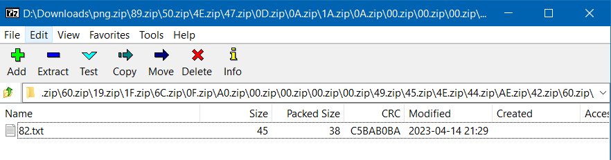
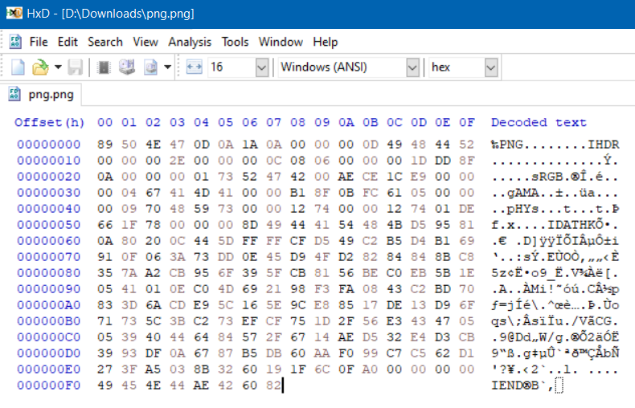

# Puzzle 01: Down the rabbit hole

[Puzzle description](https://www.steamgifts.com/discussion/nLkTR/)

Start by downloading the [ZIP](png.zip) file I prepared for you, and go down the rabbit hole ;)

## Solution

  
Reveal

  The file name `png.zip` gives a hint that the zip file hides a PNG image somewhere.

  The zip file contains multiple nested inner zips, each one named with two characters being hex values.

  Consulting the [PNG](https://en.wikipedia.org/wiki/PNG#File_format) article on Wikipedia,
  you'll notice that the first few nested files correspond to the known PNG header (`89 50 4E 47 0D 0A 1A 0A`),
  so the idea should be clear that the image bytes have been encoded as the names of the nested files,
  and all needs to be done is traverse the nested archives and reconstruct the bytes of the image using the collected names.

  The `png.zip` file is 248 levels deep, so the process is doable by hand.

  To do it manually, just open the nested files in your preferred archive manager (e.g 7-Zip file manager)
  one aftre the other until you reach the end:

  

  copy the resulting path from the address bar:

      D:\Downloads\png.zip\89.zip\50.zip\4E.zip\47.zip\0D.zip\0A.zip\1A.zip\0A.zip\...\42.zip\60.zip\82.txt

  format it to keep only the hex values and paste the result in a HEX editor of choice:

  

  Finally display the image file to reveal the code.

  Of course, you can also write a script to traverse the nested zips, see the codes attached.

